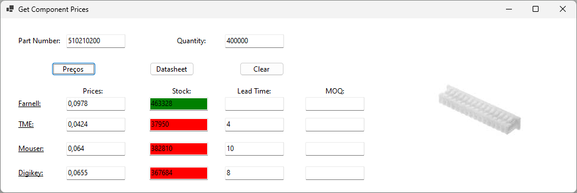

# Get Components Prices

Program that retreives data from electronic components stores. It interactes with 4 different websites (Farnell, TME, Mouser and Digikey) using their APIs.

The user should input the part number and the quantity desired. The program will retreive the prices, stock, lead time and MOQ information. The price is be display in the currency based on the api endpoint or parameters (check the configuration bellow). The stock represents the actual stock, it will fill with red colour if the amount available is lower than the desired quantity. The lead time in weeks only gets displayed if there's not enough stock. The MOQ only displays if the quantity desired is lower than the minimum order quantity (MOQ). The user can also check the component datasheet and if the store name is underlined then the user can click it and would be redirected to the component page in the respective store.

## Configuration
Each store have is own autentication system. So, in order to use the program it should be configurated previously. The user should read carefully the APIs instructions in each store, to be able to retreive the access tokens. After that the tokens should be inserted in to app.config file, on the respective fields. The more challanging API is the Digikey where the user have to inserted manually the access tokens and refresh tokens in the dk_oauth.json file (this tedious proccess has to be improved)

## Improvements

* Digikey API has tokens that expire with the time, when a program isn't used in a while a manual procedure has to be done to get new tokens. This procedure should be included in the program.
* Due to the fact that the same part number can be represented in different ways through the stores, it represents a huge challenge. At the moment I'm removing all the "-" in the p/n. (For example, a p/n from Molex 510210200 is represented as 51021-0200 in some stores).
* Create a configuration wizard when it's the first time using the program. And also a settings button where a user can modify the tokens easily any time.
